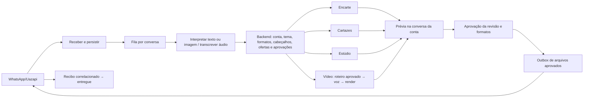

# Criação pelo WhatsApp na conta cliente

A instância exclusiva Job Varejo envia eventos ao webhook n8n `jobvarejo-whatsapp-criacao`. O backend autentica serviço e provedor, resolve o telefone verificado em um perfil ativo de cliente, admin ou super admin e mantém esse mesmo perfil como dono em todos os pedidos, assets e projetos. Admins usam a própria conta pelo WhatsApp; não há seleção implícita de outro cliente por cookie ou por ID na mensagem. Editores continuam recusados neste atendimento. A consulta considera a forma móvel brasileira com e sem o nono dígito, recusa vínculo ambíguo e preserva telefones fixos.

Os 11 workflows e seus IDs estão em `integrations/n8n/whatsapp-creation/`. Credenciais ficam no n8n e variáveis privadas no Coolify. Os JSON não contêm segredos; IDs de credenciais e subworkflows pertencem à instalação atual. Para outra instalação, remapear IDs/credenciais e validar contratos; não importar os arquivos indiscriminadamente sobre uma instalação existente.

## Backend

- `POST /api/whatsapp-creation/:operation`: ingest, claim, interpret-audio, apply, fail, outbox-claim, outbox-ack, poll-jobs, follow-up-themes, workflow-error.
- `POST /api/whatsapp-creation/generate/:kind`: encarte, video, cartaz, studio.
- Todas exigem `x-jobvarejo-service-key`. Ingest exige ainda token e nome/ID da instância exclusiva no envelope Uazapi. Não são endpoints para usuários escolherem um owner/accountId.
- A migração manual `database/whatsapp_creation_migration.sql` cria sete tabelas duráveis. Foi autorizada e aplicada no banco de produção em 04/10/2026. Não há auto-DDL neste adaptador.
- Elementos nativos editáveis e projetos continuam nas tabelas existentes com `owner_id`/`user_id` do cliente. O adaptador revalida proprietário, perfil ativo e acesso antes de gerar/enviar.
- Acesso ao Estúdio permite arte própria para o cliente; administrar/publicar modelos continua exigindo a permissão nativa privilegiada.

## Aprovações e falhas

Tema → formatos → cabeçalhos reais → lista/divisão → dados → fotos → roteiro (vídeo) → geração → prévia → aprovação versionada → envio. Uma aprovação parcial é limitada aos números do texto humano. A IA não pode ampliar a seleção. Foto rejeitada exige substituição; alteração invalida aprovações anteriores.

Story contém até nove ofertas por página; excesso exige páginas ou departamentos. Vídeo contém no máximo seis ofertas por vídeo. Não descartar produtos automaticamente.

Tema indisponível é revisto em quatro horas; se continuar ausente, fica pendência de preparação humana e o cliente pode escolher outro tema. Esse mecanismo não gera automaticamente um novo cabeçalho temático nem garante prazo de criação.

Leases serializam a conversa; envios ficam numa outbox. Timeout de envio é incerto e não dispara repetição automática. Recibos podem chegar antes do ACK e ficam em ledger. Uma geração órfã exige revisão/confirmação antes de retomar; locução paga não é repetida cegamente.

## Variáveis privadas

- JOBVAREJO_WHATSAPP_SERVICE_KEY (mínimo 32 bytes)
- JOBVAREJO_UAZAPI_INSTANCE_TOKEN / JOBVAREJO_UAZAPI_INSTANCE_ID / JOBVAREJO_UAZAPI_INSTANCE_NAME
- JOBVAREJO_UAZAPI_URL
- JOBVAREJO_OPENROUTER_MODEL (padrão do backend xiaomi/mimo-v2.6-flash; o nó `Interpretar pedido` do n8n substitui por `google/gemini-3.1-flash-lite`, com `provider.allow_fallbacks=true`, desde 05/10/2026 após limite 429 do provedor anterior)
- JOBVAREJO_OPENROUTER_AUDIO_MODEL (padrão google/gemini-2.5-flash-lite)

A voz e o render de vídeo usam o worker nativo ElevenLabs/Remotion já configurado. Os fluxos não têm loops aguardando resposta humana nem retries HTTP automáticos de operações pagas/envios. Não salvar dados de execução no n8n, pois o envelope e os anexos contêm dados privados.

## Verificação

Testes em `tests/whatsapp-creation` e `tests/server/whatsappCreation*.test.ts`; typecheck, build e client-chunk gate. O teste de Playwright local é ignorado se o runtime estiver ausente; as execuções temporárias no servidor são evidência separada. Aprovação em testes com mocks não equivale a um pedido real entregue por Uazapi.
